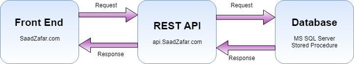

# JumpCut Hiring Project

I have developed this project using ASP.NET with MVC, C# as server side language and SQL server as database. This project does not interact directly with database at any level. <b>All of its database level operations are being done by REST API specially developed for this project.</b> Below-mentioned is overview of application Request and Response flow:

 <h3>Pages</h3>
This project has below-mentioned pages:
<ol>
  <li><b>Signup</b> - Used To Create New User and Confirm User Email
  <li><b>Login</b> - Used To Login Using Already Created Account
  <li><b>Password Reset Request</b> - Used To Send Password Reset Instruction To User Email
  <li><b>Password Reset</b> - Used To Update New Password Entered By User
  <li><b>Home</b> - Home Page Displayed After User Successfully Logged In
</ol>

This below image will show a New User SignUp Request. I have this to help you understand (easily) how the application works.

In my effort to make our application secure I have implemented two level validations:
<ul>
 <li> Front End Jquery Validations
 <li> Back End C# Validations
</ul>
This will help us make our application secure by giving hackers tough time. If anyone bypasses front end validation then he/she will still need to deal with back end validations.

<h3>Code Management and Extensibility</h3>
When ever I code, there are three things in my mind:
<ul>
 <li> Code Reusability
 <li> Extensibility
 <li> Modular Approach
</ul>
To implement these I have included separate projects for calling Web Service API, and a sparate project named as JumptCut.Common which serves two purposes, Configurations and Entities. In our actual project I would like to move entities to a completely separate project and these entities will be used in both Web Application and Web API (REST API). This will help us maintain source code at one place only and on second place DLL will be used. 

No controller is calling REST API directly all calls are going through "JumpCut.Services" project. Currently there is only one service named as "ServiceLayer". In future when we will add more modules in it. All modules will have independent services in "JumpCut.Services" project. We will also use this layer to perform basic data manipulation on data received from API. So if there is some change required in future which affects only data manipulation we can simply work this project and do a partial deployment on server. By doing this we can save time and risk of full deployment.

I am also re-using code for validations at front end and back end levels. For front end I have used HTML attribute "name" to identify elements instead of using IDs (which should be unique application wide). By using name I have re-used methods to display error messages for each control. On back end, Validations method for each control type is written (FullName, Email and Password). Then these methods are being used for validations of all pages. 

Above mentioned are just some examples I have implemented this on application wide. In my last job there were rapid changes required during an application development and even after deployment some quick changes and enhancements were often requested. So I developed this habbit to code like this to make code more manageable.

<h3> Securiy </h3>

Security is one of the major part of website development these days. I have implemented some of the basic security features here but obviously we can extend these in our production project.

<ul>
 <li>Two Level User Input Validations
 <li>Encrypting User Data of Data
 <li>Using OAuth Authentication
 <li>Storing Encrypted Data To Database
 <li>Protection Against SQL Injection
 <li>Using SQL User With Limited Access to Database Operations 
</ul>

<h4>Two Level User Input Validations</h4> 
I have used front end and back end validation which will protect us if someone bypasses front end validation.

<h4>Encrypting User Data of Data</h4> 
I have encrypted user password before sending request to REST API. We can encrypt as many fields as we want using the same method. Further more we will also use SSL encryption for our production environment.

<h4>Using OAuth Authentication</h4>
Our [Web API](http://api.saadzafar.com)  using OAuth authentication. It means we will have to generate access token with username and password in order to use end points. Our access token is valid for a certain time period, which we can change from 1 minute to as long as we want. Without valid access token no one is able to use this api.

<h4>Storing Encrypted Data To Database</h4>
I have saved encrypted password in our password. This will help us save from two scenarios. In a very unfortunate scenario if our database is compromised then it will not be a piece of cake to decrypt these passwords and our users will be secured and we (and our users) will have time to change their passwords.
Secondly, it will also secure our customers password from potential data leaks from with in company. Angry employees exists :)

<h4>Protection Against SQL Injection</h4>
I have used SQL Server Stored Procedures which provides us safety from SQL injection.I have also avoided one of the major mistake which is to use dynamic generated SQL query for database. I performed penetration testing on some online available tools and result from one of it is below:

<h4>Using SQL User With Limited Access</h4>
As I am using a shared and cheap web hosting so I have limited to access to user roles here. But I still have tried to use a database user with only required permissions on database. This will also save us from escalated user permission attack.

These are some of the steps which I have implemented. Although I also wanted to implment safety from brute force attacks. Which can be implemented in production environment. Apart from this there are many other securities which is necessary for securing web applications.

